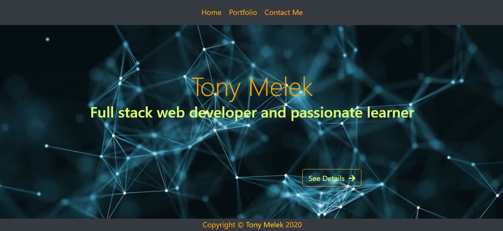
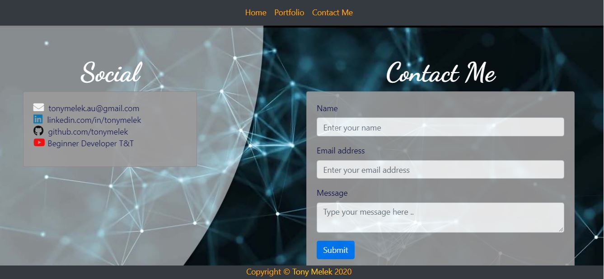
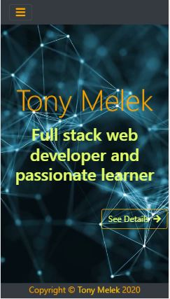

# Portfolio
## Description
My Portfolio has a list of the projects that I have built and links to my social media ( Linked-in and GitHub and my YouTube channel `Beginner Developer Tips and Tricks).
The project has 3 pages:
* Landing Page (Home and  About me).

* Portfolio (My projects)

* Contact Me

*The Site is responsive*

## Technologies used
My portfolio maked use of the `Bootstrap` framework, in addition to `HTML-5` and `CSS-3`

## Test
Please, folow the  link to [My Portfolio](https://tonymelek.github.io/myportfolio/) webpage.

## Contact Me
Please, feel free to send me an e-mail and /or add me to your linked-in and subsribe to my channel on YouTube.

## Feedback
You are welecome to provide any feedback or comments on the code to be sent to  my e-mail
[tonymelek.au@gmail.com](mailto:tonymelek.au@gmail.com)

## License
My prortfolio is &copy; copyight to Tony Melek 2020